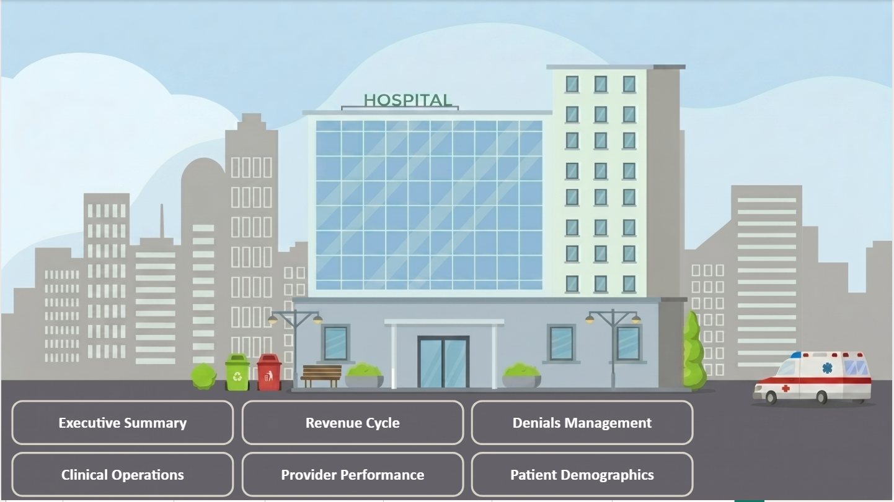
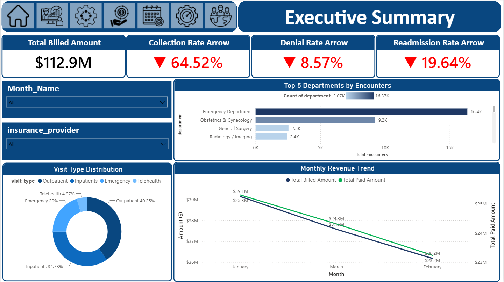
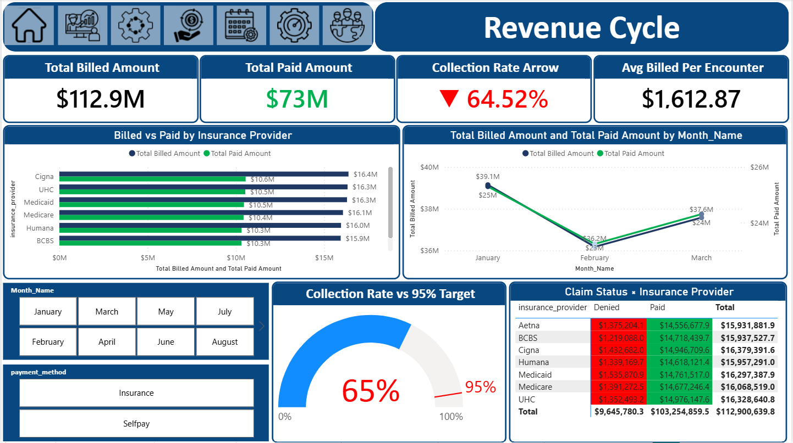
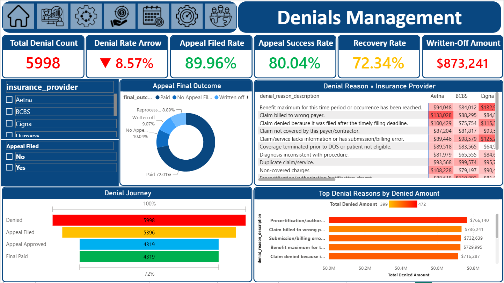
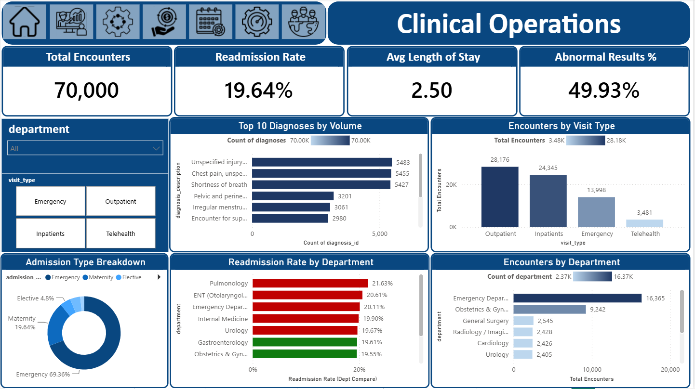
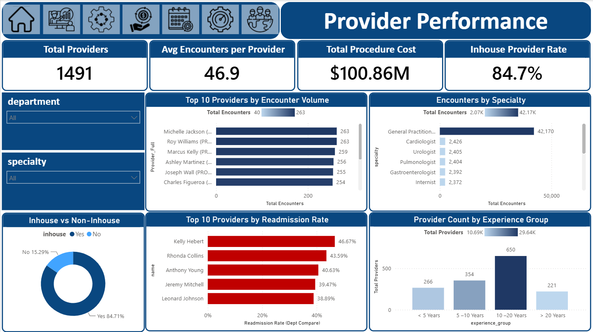
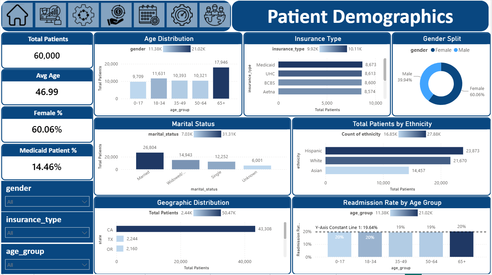
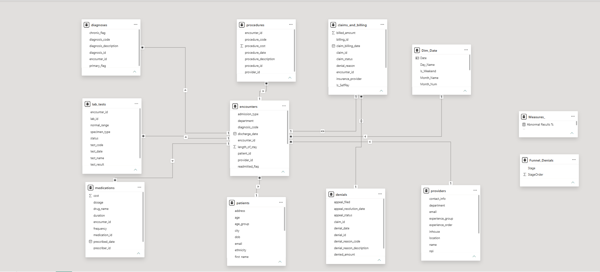

# CA Hospital Analysis 🏥

## End-to-End Power BI Business Intelligence Solution for Hospital Operations



---

## 📌 Overview

CA Hospital Analysis is an end-to-end Business Intelligence project developed using Power BI to analyze hospital operations, financial performance, clinical activities, and operational efficiency.

The project demonstrates a complete BI workflow including:

- Data understanding
- Data cleaning
- Data modeling
- KPI development
- Dashboard design
- Business storytelling
- Executive reporting

The goal is to transform healthcare data into actionable insights that support better decision-making.

---

# 🎯 Business Objectives

This project focuses on answering key business questions:

- How is hospital revenue performing?
- What are the main causes of claim denials?
- Which providers demonstrate the highest performance?
- How are patients distributed across demographics?
- How efficiently are hospital operations managed?

---

# 🚀 Dashboard Features

## Executive Summary

Provides high-level KPIs and management insights including:

- Revenue performance
- Patient activity overview
- Operational indicators
- Executive-level monitoring

## Revenue Cycle Analysis

Analyzes:

- Claims and billing performance
- Revenue trends
- Financial indicators
- Billing efficiency

## Denials Management

Focuses on:

- Denial analysis
- Claim rejection patterns
- Financial impact of denied claims

## Clinical Operations

Analyzes:

- Patient encounters
- Diagnoses
- Procedures
- Laboratory activities
- Medication usage

## Provider Performance

Evaluates:

- Provider activity
- Operational contribution
- Performance comparison

## Patient Demographics

Explores:

- Patient distribution
- Demographic patterns
- Healthcare utilization insights

---

# 📊 Dashboard Preview

## Executive Summary



## Revenue Cycle



## Denials Management



## Clinical Operations



## Provider Performance



## Patient Demographics



---

# 🏗️ Data Model

The project follows a structured data modeling approach using Star Schema principles.



Main Tables:

- Patients
- Encounters
- Claims & Billing
- Providers
- Diagnoses
- Procedures
- Lab Tests
- Medications
- Denials

---

# 🛠️ Tools & Technologies

- Power BI Desktop
- Power Query
- DAX
- Data Modeling
- Star Schema
- Business Intelligence Concepts

---

# 💼 Business Impact

This solution helps healthcare decision-makers:

- Monitor operational performance.
- Identify revenue cycle issues.
- Understand denial patterns.
- Improve resource utilization.
- Support data-driven decisions.

---

# 🧠 Skills Demonstrated

- Business Understanding
- Data Cleaning
- Data Transformation
- Data Modeling
- DAX Measures Development
- KPI Design
- Dashboard Development
- Data Visualization
- Business Storytelling

---

# 📂 Project Structure

```
CA-Hospital-Analysis
│
├── Dataset
├── Documentation
├── Images
├── Power BI
└── README.md
```

---

# 👤 Author

**Khaled ThapT**

Data Analyst | Power BI Developer
